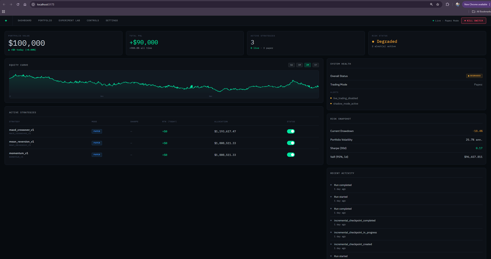
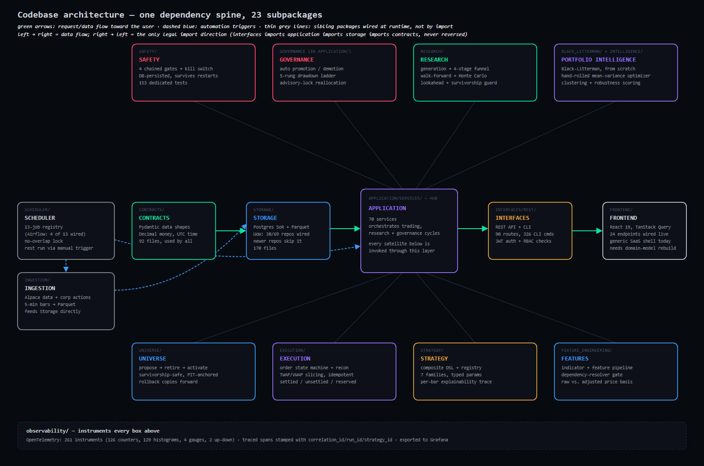
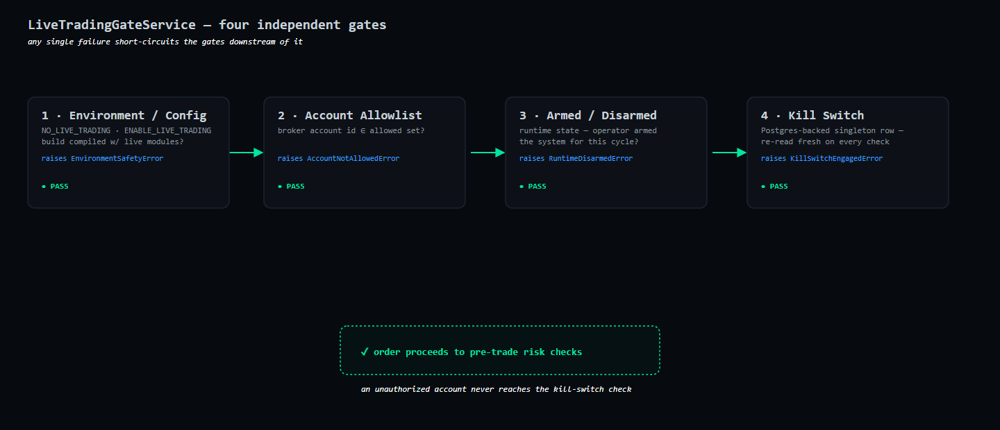
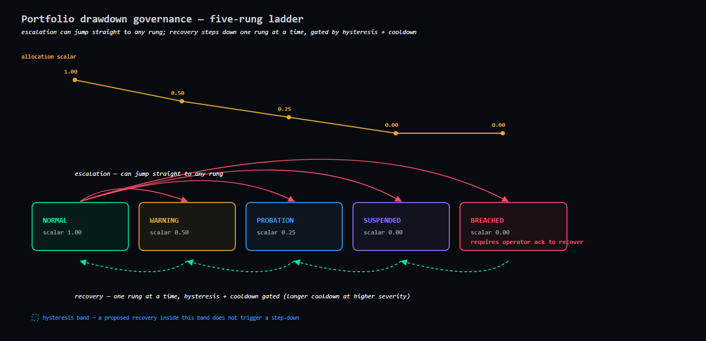

# Autonomous Trading Platform

Built solo, backend-first, with most of the effort in the research and risk engine. One engine runs the same strategy logic across backtesting, paper trading, and live execution; live trading is gated behind several independent safety checks rather than a single on/off flag.



## System Overview

The backend is layered strictly, and dependencies only ever point inward:



A `Signal` becomes an `OrderIntent`, which becomes a `BrokerOrder`/`Fill`, which updates `Positions` and rolls up into `Reports` — and that same contract chain is used whether the run is a historical backtest, a paper trading cycle, or (once enabled) live. One engine, one set of data shapes, three execution contexts.

Requests flow through a fixed middleware stack: `RequestID → Logging → JWT → Deprecation`.

The one non-negotiable: `NO_LIVE_TRADING` is enforced at runtime, not just in config. Live order submission requires clearing several independent gates (below) — no single flag flip puts real capital at risk.

## Key Features

**Safety**



- A DB-persisted kill switch that survives process restarts and crashes — killing trading doesn't depend on an in-memory flag.
- Layered enablement gates: a build-time gate, a config gate, and a runtime human-confirmed activation step, plus a broker account allowlist and hard caps/throttles on order size and rate.
- Strict environment isolation between paper and live, with `NO_LIVE_TRADING` enforced at runtime as the final backstop.
- A reconciliation model that freezes trading and requires human acknowledgment on any mismatch between internal state and the broker's.

**Research / Strategy / Experiment Systems**
- A strategy registry (moving average crossover, momentum, mean reversion, factor-based, and composite-rule strategies, plus test/fixture strategies) with warmup/validator/generation metadata per entry.
- Reproducible experiment artifacts — every run produces a manifest with dataset lineage hashes so results can be traced back and replayed exactly.
- A six-stage validation pipeline: survivorship validation, walk-forward validation, regime-concentration checks, overfitting analysis, deterministic stress testing (volatility spikes, return shocks, drawdown amplification, trend reversal, liquidity collapse), and parameter sensitivity.

**Governance & Capital Allocation**



- A five-rung progressive drawdown governance ladder (NORMAL → WARNING → PROBATION → SUSPENDED → BREACHED) with hysteresis and cooldowns so the system doesn't flap in and out of restrictions on noisy data.
- Portfolio-level and sector concentration risk limits enforced pre-trade, plus strategy health monitoring that can auto-demote a strategy or auto-promote it between research/paper tiers based on live performance — promotion to live trading remains a manual, admin-gated step.
- Multi-strategy capital allocation: risk parity / risk budgeting allocation, a Black-Litterman research service for view-based allocation, a pure-numpy mean-variance optimizer (projected gradient descent with KKT bisection), and signal netting across strategies (conservative, dominant, proportional, plus allocation- and confidence-weighted variants) to avoid strategies fighting each other for the same exposure.

**Portfolio Intelligence**
- Market regime classification across five dimensions (trend, volatility, liquidity, mean-reversion, risk) with regime-conditioned performance analysis — so a strategy's results are broken down by the market conditions they were earned in, not just averaged.
- Correlation/covariance monitoring with cluster detection, surfacing when strategies are quietly taking correlated bets rather than diversifying.

**Data & Storage Layer**
- Postgres system-of-record for orders, fills, positions, and runtime state, alongside versioned Parquet datasets for market bars and features.
- An immutable event log covering every order and lifecycle transition, giving a full audit trail of what the system did and when.
- Time-aware universe governance: versioned universe snapshots, survivorship-bias elimination, and explicit handling of symbol lifecycle events (delisting, merger, rename) so historical backtests never "see" a universe that didn't exist at the time.

**Backtesting & Simulation Engine**
- Deterministic backtest engine that shares its execution contracts with paper/live trading — the same `Signal → OrderIntent → Fill → Position` pipeline runs historically and live, so backtest results reflect how the system actually executes.
- Fill and cost modeling with a calibrated slippage model, plus dividend- and split-aware simulation so historical P&L accounts for corporate actions correctly.

**Testing Suite**
- Unit and service tests run against SQLite in-memory; integration tests run against a real Postgres instance.
- Marker-based test segmentation (`integration`, `external`, `alpaca`, `smoke`, `paper_runtime`) so a fast unit-only pass can run separately from slower external/broker-dependent tests.

**Observability**
- OpenTelemetry instrumentation across the runtime, feeding into Grafana for metrics and traces.

## Tech Stack

**Backend**

| Layer | Tools |
| --- | --- |
| Language | Python 3.11 |
| API | FastAPI, Uvicorn |
| ORM / DB | SQLAlchemy, PostgreSQL 16, Alembic (migrations) |
| Data / Storage | PyArrow (Parquet), DuckDB |
| Market data / Broker | alpaca-py, exchange_calendars |
| Optimization | cvxpy, NumPy, SciPy |
| Orchestration | Apache Airflow |
| Observability | OpenTelemetry, Grafana |
| CLI | Typer, Rich |
| Testing | pytest, pytest-asyncio, pytest-cov |

**Frontend**

| Layer | Tools |
| --- | --- |
| Framework | React 19, Vite, TypeScript (strict) |
| Routing / Data | TanStack Router, TanStack Query, Axios |
| State | Zustand |
| Forms | React Hook Form, Zod |
| UI | Tailwind CSS, shadcn/ui (Radix primitives), Framer Motion |
| Data display | Recharts, Lightweight Charts, TanStack Table |
| Testing | Vitest, Testing Library, Playwright |

## Status

The backend is deep and functionally real: the contracts, storage, service, and API layers described above are implemented and tested, not sketched out. The frontend — Dashboard, Portfolio, Strategy Lab, Controls, Settings, and Experiment Lab — is wired to real backend endpoints, not mock data, but it was originally built around a generic SaaS-style app shell rather than the platform's actual domain model (governance, safety gates, the research pipeline). It's functional, not fake, but due for a restructuring pass rather than a wiring pass. The system currently runs in paper trading only — `NO_LIVE_TRADING` is enforced at runtime, so no real capital is at risk.

## What's Next

A full 2-year backtest validates the platform end-to-end, but that's still a controlled environment. The path from here to real deployment:

- **Performance optimization** — the monthly research pipeline (candidate generation, walk-forward, Monte Carlo validation) is the current bottleneck; profiling and speeding it up comes first, since faster iteration speeds up everything downstream.
- **Cloud deployment** — move off a local machine onto the containerized services already in place (Postgres, Airflow, observability stack), enabling continuous scheduled operation instead of manual local runs.
- **Frontend restructuring** — rebuild the UI around the platform's real domain model instead of the generic app shell it started from.
- **Paper trading** — run live against real-time market data to validate that real-world timing, latency, and execution assumptions hold up the way the backtest assumed.
- **Live trading** — after a sustained, monitored paper-trading track record, move to live capital under the existing safety architecture (layered enablement gates, persistent kill switch, drawdown governance in full enforcement mode rather than backtest's `warn_only` setting).

## Quickstart

This is a multi-service system — the full pipeline (Postgres, Airflow, ingestion, research, paper trading) involves several CLI steps, config decisions, and a specific run order, documented in `docs/operations/runbooks/` and `docs/backend/cli/`. What's below just gets the code installed and the test suite passing locally — the fastest way to confirm the codebase is real and working, without needing Docker or a database running.

```bash
# Clone
git clone https://github.com/TristanODonnell/Autonomous-Trading-Platform.git
cd Autonomous-Trading-Platform

# Backend — Python 3.11, virtual environment
python -m venv .venv
.\.venv\Scripts\activate      # Windows
# source .venv/bin/activate   # macOS/Linux

pip install -r requirements.txt
pip install -r requirements-dev.txt
pip install -e .

# Run the test suite — SQLite in-memory, no Postgres/Docker required
python -m pytest

# Frontend
cd frontend
npm install
npm run dev
```

For the full local stack (Postgres, Airflow, observability) and the CLI-driven ingestion → research → paper-trading sequence, see `docs/operations/runbooks/` and `docs/backend/cli/`.

## License

All rights reserved. This code is shared publicly for review purposes; no license is granted to copy, modify, or redistribute it.
